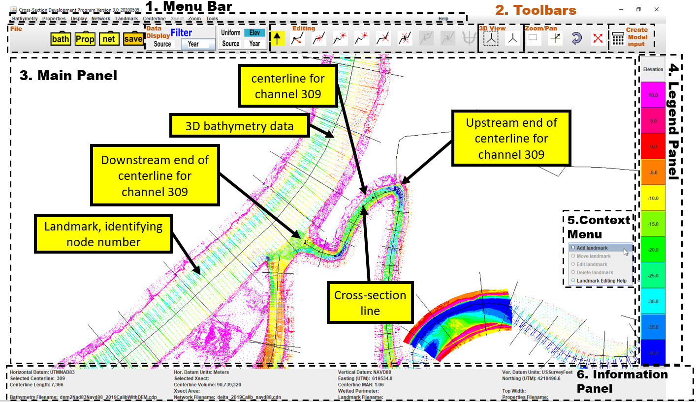
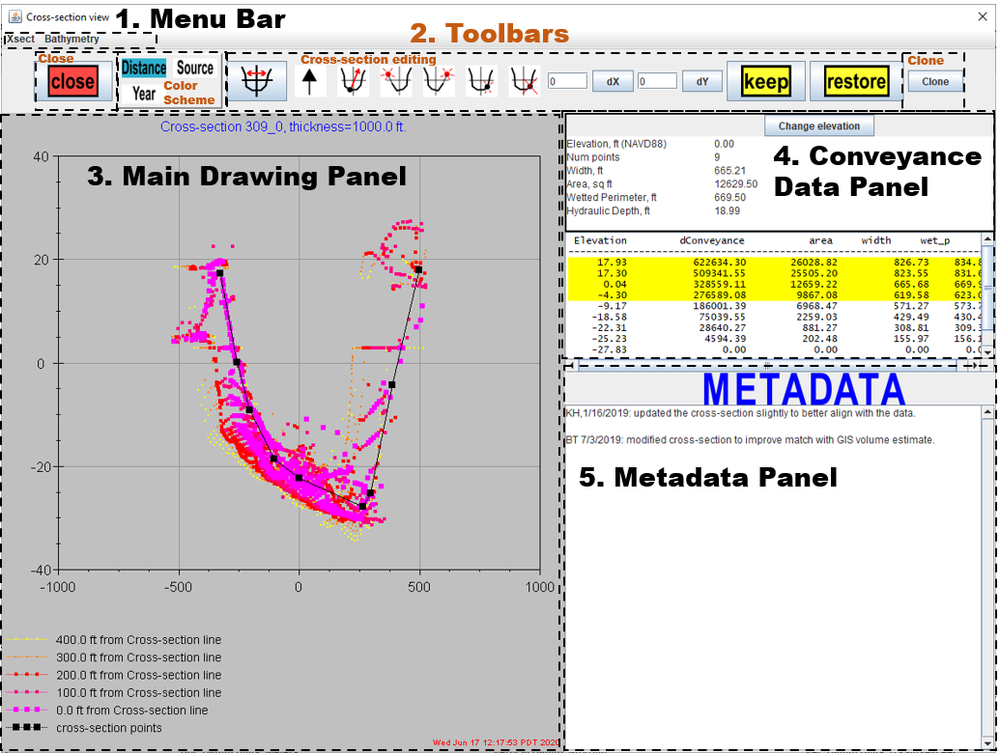
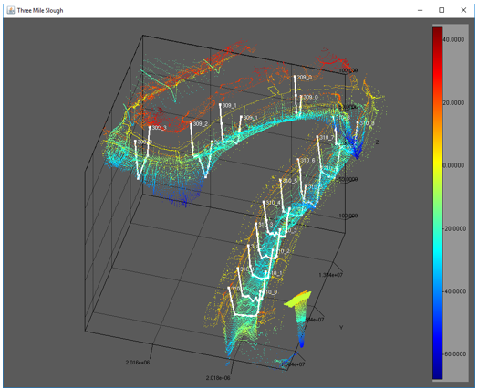

# Figures

Figures can be included like this:

# Source Code and Packaging
CSDP Source code is available here: https://github.com/CADWRDeltaModeling/csdp
CSDP executable is avialable here: https://data.cnra.ca.gov/dataset/cross-section-development-program-version-3/resource/98471d54-0244-4822-a7cd-2a5cf30636b8

# Acknowledgements

We acknowledge contributions from Ralph Finch during the genesis of this project.

# References

CADWR. Cross-Section Development Program. In Methodology for Flow and Salinity Estimates in the Sacramento-San Joaquin Delta and Suisun Marsh: 19th Annual Progress Report (1998). https://data.cnra.ca.gov/dataset/methodology-for-flow-and-salinity-estimates-in-the-sacramento-san-joaquin-delta-and-suisun-marsh/resource/44093c61-51fe-411f-8425-efc167d1ec6f

CADWR. DSM2 GIS Reference. In Methodology for Flow and Salinity Estimates in the Sacramento-San Joaquin Delta and Suisun Marsh: 41st Annual Progress Report, (2020). https://data.cnra.ca.gov/dataset/methodology-for-flow-and-salinity-estimates-in-the-sacramento-san-joaquin-delta-and-suisun-marsh/resource/a6b3b557-ad17-4490-b9f0-17b88cfb8241
